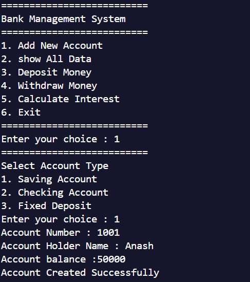
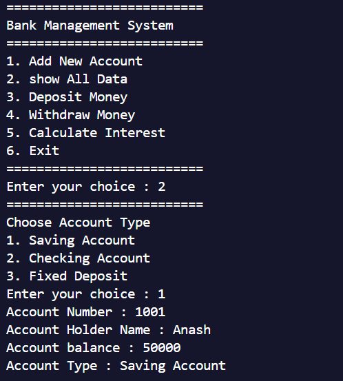
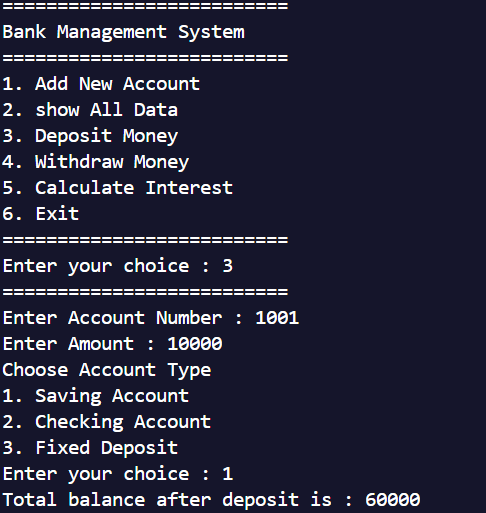
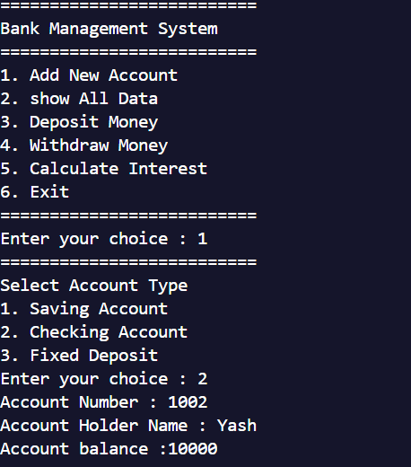
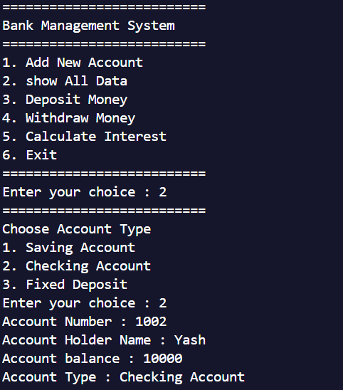
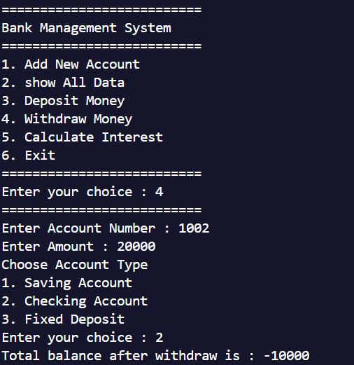
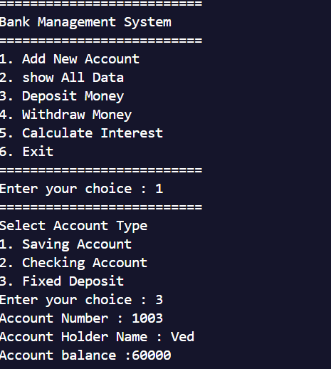
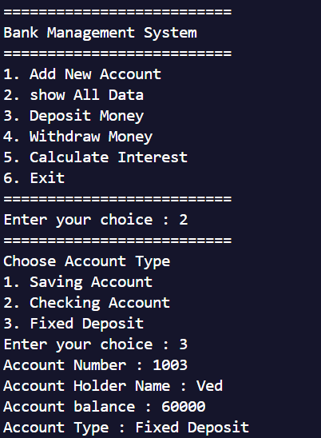
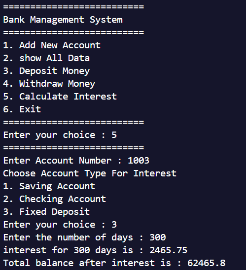
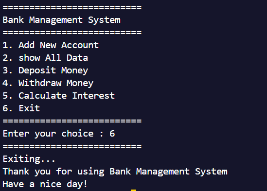

# Bank Management System

## Features

### 1. Account Management
#### Saving Account
- Add new saving account

- View saving account details

- Deposit to saving account

#### Checking Account
- Add new checking account

- View checking account details

- Withdraw from checking account

#### Fixed Deposit Account
- Add new fixed deposit account

- View fixed deposit account details

- Calculate interest on fixed deposit

### System Controls
- Program exit interface
